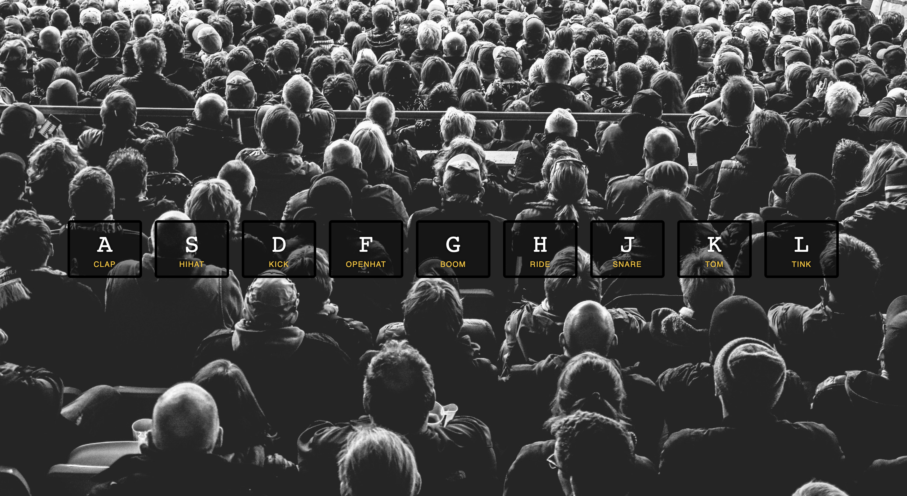

# Drum-Kit2

## Overview

### The challenge

Users should be able to:

- View the optimal layout for the component depending on their device's screen size
- See hover states for all interactive elements on the page
- Press relevant keyboard buttons to play the drum kit

### Screenshot

### Links

- Live Site URL: [https://yusuf-demirci.github.io/Drum-Kit2/](https://yusuf-demirci.github.io/Drum-Kit2/)

### Built with

- Semantic HTML5 markup
- CSS custom properties
- JavaScript

